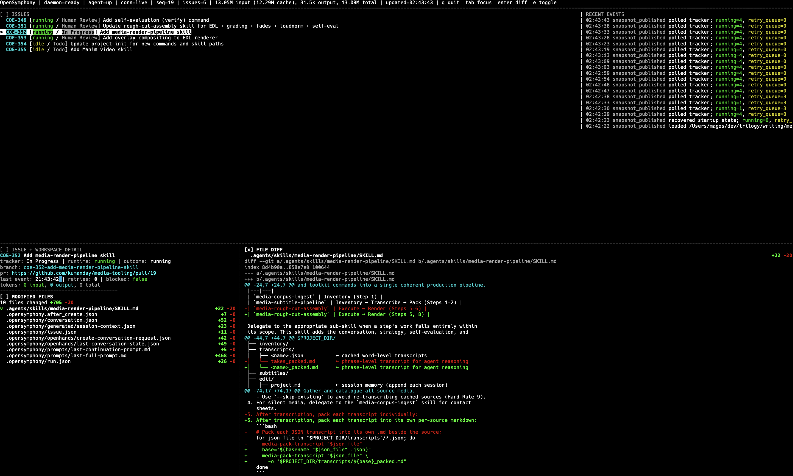
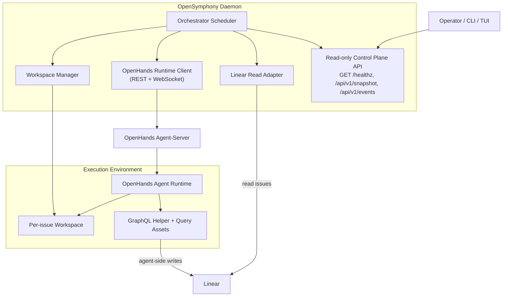

# OpenSymphony

OpenSymphony is a Rust implementation of the [OpenAI Symphony](https://github.com/openai/symphony) specification for orchestrating AI coding agents. It connects to [Linear](https://linear.app) for issue tracking and uses [OpenHands](https://github.com/OpenHands/OpenHands) as the agent runtime.



## What is OpenSymphony?

OpenSymphony automates software development workflows by:

1. **Polling Linear** for issues in active states (Todo, In Progress, etc.)
2. **Creating isolated workspaces** for each issue with lifecycle hooks
3. **Dispatching AI agents** via OpenHands to work on issues autonomously
4. **Managing retries, reconciliation, and cleanup** based on issue state changes
5. **Providing a terminal UI** (FrankenTUI) for monitoring and operator control

### Key Features

- **Hierarchy-aware scheduling**: Parent issues wait for sub-issues to complete
- **WebSocket-first runtime**: Real-time agent updates with REST reconciliation
- **Per-issue workspaces**: Deterministic, isolated directories with lifecycle hooks
- **GraphQL-only Linear integration**: Agent-side Linear reads and writes through checked-in helper/query assets
- **Conversation reuse policies**: Default per-issue reuse with optional fresh-per-run resets
- **Local-first MVP**: Trusted-machine deployment with optional hosted mode

OpenSymphony `1.0.0` is the compatibility boundary for the GraphQL-only Linear
rewrite. See [Migration Guide](docs/migration-1.0.0.md) if you are upgrading an
older setup.

Packaging note: crates.io exposes a single public package, `opensymphony`.
Internally, the repo still keeps clear subsystem boundaries under
`crates/opensymphony-*`, but those directories are now internal module trees,
not separately published crates.

## Quick Start

### Prerequisites

- Rust toolchain (stable)
- Python 3.13.12 with `uv` for OpenHands server
- Linear API key (for tracker integration)
- LLM API key (any LiteLLM-compatible provider: OpenAI, Anthropic, Fireworks, etc.)

For platform-specific Rust and Python/`uv` setup steps, see [Prerequisites](docs/prerequisites.md).

### Installation

```bash
cargo install opensymphony
```

OpenSymphony manages a local OpenHands agent-server; install the pinned runtime like this:

```bash
opensymphony install openhands
```

To refresh the installed CLI later, run:

```bash
opensymphony update
```

When you run `opensymphony update` from a target-repo root that already has
`WORKFLOW.md` and `config.yaml`, it also refreshes the template-managed
`.agents/skills/` tree without rerunning the full `init` flow.

### Required Environment

Before running `opensymphony run`, add the required tracker and OpenHands secret
values to your shell startup file, such as `~/.zshrc` or `~/.bashrc`:

```bash
export LINEAR_API_KEY="lin_api_..."
export OH_SECRET_KEY='any-random-key'
```

Use your real Linear API key for `LINEAR_API_KEY`. `OH_SECRET_KEY` can be any
random secret string for the local OpenHands runtime.

Also export your provider settings for the OpenHands conversation agent:

```bash
export LLM_MODEL="openai/accounts/fireworks/models/glm-5p1"
export LLM_API_KEY="fw-..."
export LLM_BASE_URL="https://api.fireworks.ai/inference/v1"
```

These `LLM_*` variables are required unless your target repo's `WORKFLOW.md`
has been customized to resolve the LLM configuration some other way.

### Bootstrap A Target Repo

Bootstrap the target repository in place:

```bash
cd /path/to/target-repo
opensymphony init
```

`opensymphony init` guides the bootstrap flow, customizes `WORKFLOW.md`, and
can optionally scaffold automated code review via the [OpenHands PR Review Plugin](https://github.com/OpenHands/extensions/tree/main/plugins/pr-review), including GitHub setup through `gh` when it is installed and authorized for the target repo. It also ensures `.gitignore` ignores local OpenSymphony runtime state.
If `AGENTS.md` already exists during first-time setup, `init` leaves it alone
and writes the starter guidance to `AGENTS-example.md` for review.
It also initializes `.opensymphony/memory/memory.yaml`, the shared policy and
learned structure file required for default-on memory auto-capture.
At the end of a successful bootstrap, `init` prompts whether to commit and push
the generated OpenSymphony files so shared skills and, when selected, AI PR
Review setup are in the remote repository before story work begins.

For an existing target repo, `opensymphony update` is the lighter-weight
maintenance path: it refreshes changed or new template-owned skill files under
`.agents/skills/` without touching `WORKFLOW.md`, `AGENTS.md`, or the broader
bootstrap files. When run from an OpenSymphony target repo, `update` also
initializes or repairs the memory config and `.gitignore` policy if needed.

### Running the Orchestrator

Then start from the target repository:

```bash
cd /path/to/target-repo
opensymphony run
```

For real-time monitoring while the orchestrator is running, run the TUI in a separate terminal window:
```bash
opensymphony tui
```

### Further Details

For generated files, environment variables, `config.yaml`, and the template
repo details behind `init`, see [Configuration](docs/configuration.md).

For alternate config paths, `debug`, `rehydrate`, packaging, and local operator
workflows, see [Operations](docs/operations.md).

Optional troubleshooting and validation:

```bash
cd /path/to/target-repo
opensymphony doctor
```

To inspect the command surface, run:

```bash
opensymphony --help
```

### Project Memory

OpenSymphony can preserve completed-issue knowledge as you build. When
`memory.auto_capture` is enabled in `config.yaml` (the default),
`opensymphony run` captures terminal issue transitions from Linear and matching
GitHub PR narrative, writes private memory under `.opensymphony/memory/`, and
syncs stable learned topics into public docs. Repos initialized or updated with
this release get the required memory config automatically.


The generated issue capsules are Markdown files, so `.opensymphony/memory/` can
also be opened as an Obsidian vault. That gives operators a graph view of issue,
milestone, and documentation-topic relationships while keeping private capture
artifacts out of the public docs.

Manual commands remain available for setup repair, backfill, inspection, and
guarded archival:

```bash
opensymphony memory init
opensymphony memory capture COE-123
opensymphony memory brief COE-123
opensymphony memory related --area openhands-runtime
opensymphony memory sync-docs --since-last-sync
opensymphony linear archive --issues COE-123
```

See [Project Memory](docs/memory.md) for archive guards, YAML import/backfill,
source schema, automation flags, and the distinction between CLI commands and
template-managed agent skills.

The memory index uses DuckDB's bundled build so local installs do not need a
separate DuckDB system package. That choice adds compile time and binary size,
but keeps the memory database portable for local-first operator workflows.

## Architecture



### Internal Boundaries

OpenSymphony keeps explicit internal subsystem boundaries while shipping as one
installable crates.io package:

| Internal module tree | Responsibility |
|-----------|----------------|
| `opensymphony_orchestrator` | Poll loop, scheduling, retries, state machine |
| `opensymphony_linear` | GraphQL client for orchestrator-side Linear reads |
| `opensymphony_memory` | Issue capsules, DuckDB memory index, docs sync, archive eligibility |
| `opensymphony_openhands` | REST/WebSocket client for agent runtime |
| `opensymphony_workspace` | Workspace lifecycle, hooks, containment |
| `opensymphony_control` | Control plane API and snapshot derivation |
| `opensymphony_tui` | FrankenTUI operator client |
| `opensymphony_cli` | CLI entrypoints: init, run, debug, memory, linear archive, daemon (demo), tui, doctor, rehydrate |

## Deployment Modes

### Local Supervised Mode (MVP)

The default mode for individual developers:

- One OpenHands server subprocess managed by the daemon
- Host filesystem access (process-level isolation)
- Loopback-only binding
- No auth by default

```yaml
openhands:
  transport:
    base_url: http://127.0.0.1:8000
```

### External Local Mode

For debugging or CI with a manually managed server:

```yaml
openhands:
  transport:
    base_url: http://127.0.0.1:8000
    session_api_key_env: OPENHANDS_API_KEY
```

### Hosted Remote Mode (Future)

For organizational deployment with stronger isolation:

```yaml
openhands:
  transport:
    base_url: https://agent-server.example.com
    session_api_key_env: OPENHANDS_API_KEY
  websocket:
    auth_mode: header
```

See [docs/deployment-modes.md](docs/deployment-modes.md) for full details.

## Workspace Lifecycle

Each issue gets a deterministic workspace:

```
<workspace_root>/<issue_identifier>/
├── .opensymphony/
│   ├── issue.json              # Issue metadata
│   ├── conversation.json       # Conversation registry and launch profile
│   └── openhands/
│       └── create-conversation-request.json
├── .opensymphony.after_create.json  # Hook receipt
├── <repo_files>                # Cloned repository
└── logs/                       # Execution logs
```

## Debugging Sessions

Use `opensymphony debug <issue-id>` to reopen the OpenHands conversation that OpenSymphony used for that issue:

```bash
cd /path/to/target-repo
opensymphony debug COE-284
```

The command resolves the issue reference to its managed workspace, reads
`.opensymphony/conversation.json`, and resumes the same `conversation_id` from the
original working directory. The conversation registry persists the issue reference,
stable OpenHands conversation ID, timestamps, transport details, and the launch
profile that created the session so a missing-but-recoverable thread can be
rehydrated without losing continuity.

When the workflow uses the local supervised OpenHands server, `opensymphony debug`
targets the same configured base URL as the orchestrator. If a ready server is
already listening there, the debug command reuses it; otherwise it waits through
the configured startup window before starting a local server for the session. The
default managed-local startup window is 180 seconds so agent-server has enough
time to import the pinned environment and scan its active persistence store on
slower local machines. For the most predictable behavior, prefer the
orchestrator-managed server and avoid leaving unrelated standalone `openhands`
CLI sessions bound to the same port. Stop `opensymphony run` with Ctrl-C so the
managed OpenHands process tree can be cleaned up; Ctrl-Z only suspends the
orchestrator and can leave the port bound.

Managed local OpenHands conversations are scoped by target repository under
`<tool_dir>/workspace/conversations/repos/<repo-key>/`. The orchestrator starts
OpenHands with `OH_CONVERSATIONS_PATH` pointing at that repo's `active/` store,
so older archived work is not eagerly loaded during normal runs. Before startup,
known terminal issue conversations from existing workspace manifests are moved
into `archived/`, and current Linear candidate issues are moved into `active/`
from the legacy flat store or `archived/`. This legacy-store migration is a
temporary compatibility shim for earlier OpenSymphony versions and can be
removed after existing installs have aged out. Linear archive operations move
matching issue conversations into `archived/`; `opensymphony debug <issue-id>`
searches both stores and starts the managed server against the store that
contains the requested conversation.

### Lifecycle Hooks

- `after_create`: Clone repository, setup environment
- `before_run`: Pre-execution checks
- `after_run`: Post-execution cleanup
- `before_remove`: Final cleanup before workspace deletion

## Testing

```bash
# Unit tests
cargo test

# Static validation
opensymphony doctor

# Live tests (requires OpenHands server)
OPENSYMPHONY_LIVE_OPENHANDS=1 cargo test --test live_local_suite -- --ignored --nocapture --test-threads=1

# Smoke test
./scripts/smoke_local.sh

# Live E2E test
OPENSYMPHONY_LIVE_OPENHANDS=1 ./scripts/live_e2e.sh
```

## Documentation

- [Architecture](docs/architecture.md) - High-level design and component interactions
- [Configuration](docs/configuration.md) - Target repo bootstrap and runtime config
- [Deployment Modes](docs/deployment-modes.md) - Local vs hosted deployment
- [Operations](docs/operations.md) - Doctor, rehydration, diagnostics, and local ops
- [Testing](docs/testing-and-operations.md) - Test strategy and validation layers
- [Migration Guide](docs/migration-1.0.0.md) - Breaking changes and upgrade steps for 1.0.0
- [AGENTS.md](AGENTS.md) - Repository guidelines for coding agents
- [Development Guide](docs/DEVELOPMENT.md) - Contributing and development details

## Safety and Security

**Local Mode**: The MVP runs with process-level isolation on trusted developer machines. Agent code executes on the host filesystem. This is suitable for:
- Solo development on trusted repositories
- Local experimentation
- CI on controlled runners

**Hosted Mode** (future): Will provide stronger isolation with container-backed workspaces and mandatory auth.

## Version Pinning

OpenSymphony pins exact versions for reproducibility:

- `openhands-agent-server==1.24.0`
- `openhands-sdk==1.24.0`
- Python `3.13.12`
- Rust stable toolchain

The managed local OpenHands bundle is sourced from `tools/openhands-server/`
and provisioned with `opensymphony install openhands`.

## License

[LICENSE](LICENSE)

## Acknowledgments

- [OpenAI Symphony](https://github.com/openai/symphony) - The specification this implements
- [OpenHands](https://github.com/OpenHands/OpenHands) - The agent runtime
- [FrankenTUI](https://github.com/Dicklesworthstone/frankentui) - Terminal UI framework
