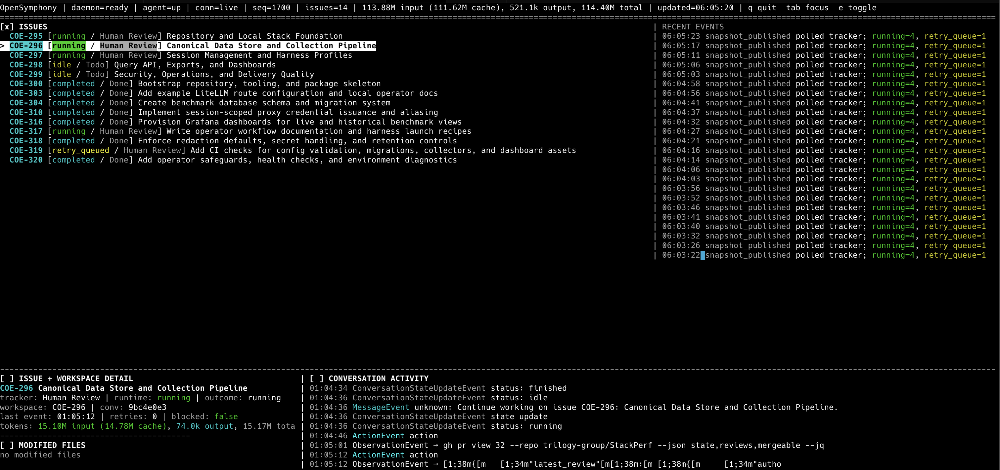

# OpenSymphony

OpenSymphony is a Rust implementation of the [OpenAI Symphony](https://github.com/openai/symphony) specification for orchestrating AI coding agents. It connects to [Linear](https://linear.app) for issue tracking and uses [OpenHands](https://github.com/OpenHands/OpenHands) as the agent runtime.



## What is OpenSymphony?

OpenSymphony automates software development workflows by:

1. **Polling Linear** for issues in active states (Todo, In Progress, etc.)
2. **Creating isolated workspaces** for each issue with lifecycle hooks
3. **Dispatching AI agents** via OpenHands to work on issues autonomously
4. **Managing retries, reconciliation, and cleanup** based on issue state changes
5. **Providing a terminal UI** (FrankenTUI) for monitoring and operator control

### Key Features

- **Hierarchy-aware scheduling**: Parent issues wait for sub-issues to complete
- **WebSocket-first runtime**: Real-time agent updates with REST reconciliation
- **Per-issue workspaces**: Deterministic, isolated directories with lifecycle hooks
- **Linear MCP integration**: Agent-side Linear writes (comments, state transitions)
- **Conversation reuse policies**: Default per-issue reuse with optional fresh-per-run resets
- **Local-first MVP**: Trusted-machine deployment with optional hosted mode

## Quick Start

### Prerequisites

- Rust toolchain (stable)
- Python 3.12+ with `uv` for OpenHands server
- Linear API key (for tracker integration)
- LLM API key (any LiteLLM-compatible provider: OpenAI, Anthropic, Fireworks, etc.)

### Installation

```bash
git clone https://github.com/kumanday/OpenSymphony.git && cd OpenSymphony

cargo install --path .

```

### Bootstrap A Target Repo

Bootstrap the target repository in place:

```bash
cd /path/to/target-repo
opensymphony init
```

`opensymphony init` guides the bootstrap flow, customizes `WORKFLOW.md`, and
can optionally scaffold automated OpenHands AI PR review.

### Running the Orchestrator

Run the preflight check from the OpenSymphony checkout:

```bash
opensymphony doctor
```

Then start from the target repository:

```bash
cd /path/to/target-repo
opensymphony run
```

Ror real-time monitoring while the orchestrator is running, run the TUI in a separate terminal window:
```bash
opensymphony tui
```

### Further Details

For generated files, environment variables, `config.yaml`, and the template
repo details behind `init`, see [Configuration](docs/configuration.md).

For alternate config paths, `debug`, `rehydrate`, packaging, and local operator
workflows, see [Operations](docs/operations.md).

To innspect the command surface, run:
```
opensymphony --help
```

## Architecture

```
┌─────────────────────────────────────────────────────────────┐
│                     OpenSymphony Daemon                     │
│  ┌─────────────┐  ┌─────────────┐  ┌─────────────────────┐  │
│  │ Orchestrator│  │   Linear    │  │   OpenHands Client  │  │
│  │  Scheduler  │  │   Adapter   │  │  (REST + WebSocket) │  │
│  └──────┬──────┘  └──────┬──────┘  └──────────┬──────────┘  │
│         │                │                    │             │
│  ┌──────▼────────────────▼────────────────────▼──────────┐  │
│  │              Workspace Manager                        │  │
│  │   (per-issue directories, hooks, manifests)           │  │
│  └───────────────────────────────────────────────────────┘  │
│                           │                                 │
│  ┌────────────────────────▼──────────────────────────────┐  │
│  │           Control Plane API (read-only)               │  │
│  │     GET /healthz, /api/v1/snapshot, /api/v1/events    │  │
│  └───────────────────────────────────────────────────────┘  │
└─────────────────────────────────────────────────────────────┘
         │                           │
         ▼                           ▼
┌─────────────┐              ┌─────────────────┐
│   Linear    │              │  OpenHands      │
│   (Issues)  │              │  Agent-Server   │
└─────────────┘              └─────────────────┘
         ▲                           ▲
         │                           │
    ┌────┴────┐                 ┌────┴────┐
    │   MCP   │                 │  Agent  │
    │  Tools  │                 │ Runtime │
    └─────────┘                 └─────────┘
```

### Component Overview

| Component | Responsibility |
|-----------|----------------|
| `opensymphony-orchestrator` | Poll loop, scheduling, retries, state machine |
| `opensymphony-linear` | GraphQL client for Linear read operations |
| `opensymphony-linear-mcp` | MCP server for agent-side Linear writes |
| `opensymphony-openhands` | REST/WebSocket client for agent runtime |
| `opensymphony-workspace` | Workspace lifecycle, hooks, containment |
| `opensymphony-control` | Control plane API and snapshot derivation |
| `opensymphony-tui` | FrankenTUI operator client |
| `opensymphony-cli` | CLI entrypoints: init, run, debug, daemon (demo), tui, doctor, linear-mcp, rehydrate |

## Deployment Modes

### Local Supervised Mode (MVP)

The default mode for individual developers:

- One OpenHands server subprocess managed by the daemon
- Host filesystem access (process-level isolation)
- Loopback-only binding
- No auth by default

```yaml
openhands:
  transport:
    base_url: http://127.0.0.1:8000
```

### External Local Mode

For debugging or CI with a manually managed server:

```yaml
openhands:
  transport:
    base_url: http://127.0.0.1:8000
    session_api_key_env: OPENHANDS_API_KEY
```

### Hosted Remote Mode (Future)

For organizational deployment with stronger isolation:

```yaml
openhands:
  transport:
    base_url: https://agent-server.example.com
    session_api_key_env: OPENHANDS_API_KEY
  websocket:
    auth_mode: header
```

See [docs/deployment-modes.md](docs/deployment-modes.md) for full details.

## Workspace Lifecycle

Each issue gets a deterministic workspace:

```
<workspace_root>/<issue_identifier>/
├── .opensymphony/
│   ├── issue.json              # Issue metadata
│   ├── conversation.json       # Conversation registry and launch profile
│   └── openhands/
│       └── create-conversation-request.json
├── .opensymphony.after_create.json  # Hook receipt
├── <repo_files>                # Cloned repository
└── logs/                       # Execution logs
```

## Debugging Sessions

Use `opensymphony debug <issue-id>` to reopen the OpenHands conversation that OpenSymphony used for that issue:

```bash
cd /path/to/target-repo
opensymphony debug COE-284
```

The command resolves the issue reference to its managed workspace, reads
`.opensymphony/conversation.json`, and resumes the same `conversation_id` from the
original working directory. The conversation registry persists the issue reference,
stable OpenHands conversation ID, timestamps, transport details, and the launch
profile that created the session so a missing-but-recoverable thread can be
rehydrated without losing continuity.

When the workflow uses the local supervised OpenHands server, `opensymphony debug`
targets the same configured base URL as the orchestrator. If a ready server is
already listening there, the debug command reuses it; otherwise it starts a local
server for the session. For the most predictable behavior, prefer the
orchestrator-managed server and avoid leaving unrelated standalone `openhands`
CLI sessions bound to the same port.

### Lifecycle Hooks

- `after_create`: Clone repository, setup environment
- `before_run`: Pre-execution checks
- `after_run`: Post-execution cleanup
- `before_remove`: Final cleanup before workspace deletion

## Testing

```bash
# Unit tests
cargo test --workspace

# Static validation
cargo run -p opensymphony-cli -- doctor

# Live tests (requires OpenHands server)
OPENSYMPHONY_LIVE_OPENHANDS=1 cargo test -p opensymphony-openhands

# Smoke test
./scripts/smoke_local.sh

# Live E2E test
OPENSYMPHONY_LIVE_OPENHANDS=1 ./scripts/live_e2e.sh
```

## Documentation

- [Architecture](docs/architecture.md) - High-level design and component interactions
- [Configuration](docs/configuration.md) - Target repo bootstrap and runtime config
- [Deployment Modes](docs/deployment-modes.md) - Local vs hosted deployment
- [Operations](docs/operations.md) - Doctor, rehydration, diagnostics, and local ops
- [Testing](docs/testing-and-operations.md) - Test strategy and validation layers
- [AGENTS.md](AGENTS.md) - Repository guidelines for coding agents
- [Development Guide](docs/DEVELOPMENT.md) - Contributing and development details

## Safety and Security

**Local Mode**: The MVP runs with process-level isolation on trusted developer machines. Agent code executes on the host filesystem. This is suitable for:
- Solo development on trusted repositories
- Local experimentation
- CI on controlled runners

**Hosted Mode** (future): Will provide stronger isolation with container-backed workspaces and mandatory auth.

## Version Pinning

OpenSymphony pins exact versions for reproducibility:

- `openhands-agent-server==1.14.0`
- `openhands-sdk==1.14.0`
- Rust stable toolchain

See `tools/openhands-server/` for the pinned environment.

## License

[LICENSE](LICENSE)

## Acknowledgments

- [OpenAI Symphony](https://github.com/openai/symphony) - The specification this implements
- [OpenHands](https://github.com/OpenHands/OpenHands) - The agent runtime
- [FrankenTUI](https://github.com/Dicklesworthstone/frankentui) - Terminal UI framework
