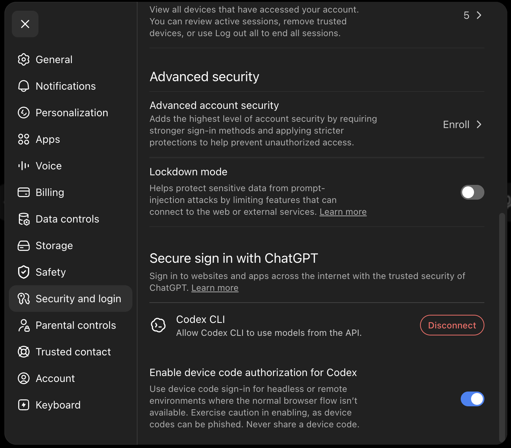

# Codex App-Server Prototype And Benchmark Report

COE-426 establishes a feature-gated Codex app-server integration shape. It does
not enable Codex as a production harness and does not route OpenSymphony issues
to Codex.

## Prototype Scope

- Feature gate: `codex-app-server-prototype`.
- Runtime kind: `codex_app_server`.
- Local transport: `codex app-server --stdio`.
- Experimental loopback WebSocket transport:
  `codex app-server --listen ws://127.0.0.1:<port>`.
- Contract source: generated Codex app-server JSON Schema and TypeScript
  bindings from the installed Codex CLI.

The prototype adds a small Rust module for:

- launch argument construction for stdio and loopback WebSocket,
- JSON-RPC request construction for `initialize`, `thread/start`, and
  `turn/start`,
- normalization of basic thread, turn, item, plan, error, and unknown
  notifications while preserving the raw payload,
- mapping existing OpenSymphony model and credential setting profiles to future
  Codex app-server use.

The companion benchmark script issues `thread/loaded/list` requests directly so
throughput can be measured without starting model-backed turns.

## Local Feature-Gated Testing

Codex app-server support is available only when OpenSymphony is built with the
`codex-app-server-prototype` Cargo feature. The feature exposes contract tests
and benchmark helpers; it does not make Codex the production issue-execution
harness.

Use the system DuckDB developer aliases for quick local verification:

```bash
cargo check-system-duckdb --features codex-app-server-prototype
cargo test-system-duckdb --features codex-app-server-prototype --test codex_app_server
```

Install or select the Codex CLI that should be tested, then confirm the
app-server surface exists:

```bash
codex --version
codex app-server --help
```

Confirm the local Codex CLI is signed in with ChatGPT:

```bash
codex login status
```

If the CLI is not logged in, use the current Codex-supported device-code auth
path:

```bash
codex login --device-auth
```

For ChatGPT accounts that have not previously allowed Codex device-code sign-in,
open ChatGPT settings and enable **Security and login -> Enable device code
authorization for Codex** before retrying the login:



After login, run a tiny real Codex model smoke test. Global Codex approval flags
go before the `exec` subcommand:

```bash
codex --ask-for-approval never exec \
  --sandbox read-only \
  "Reply with exactly: CODEX_LOGIN_OK"
```

Expected output includes `Logged in using ChatGPT` from `codex login status`,
then the model reply `CODEX_LOGIN_OK` from the smoke test.

OpenSymphony reports Codex subscription readiness through
`GET /api/v1/model-settings` and
`GET /api/v1/model-settings/credential-status`. The gateway probes only
supported Codex CLI surfaces:

- `codex --version`
- `codex app-server --help`
- `codex login status`

The model-settings response includes a `codex_local_readiness` summary with the
detected CLI version, app-server support, ChatGPT login state, and the safe
operator commands for login/status/logout. It also exposes the Codex profile as
a `codex_cli_login` credential reference under the existing
`codex-chatgpt-local-keychain` profile ID. That reference identifies the
operator-owned Codex CLI login state; it is not a copied access token, refresh
credential, or parsed private Codex credential payload.

The gateway caches the Codex readiness probe for a short in-process TTL so
repeated `model-settings` reads do not spawn new Codex subprocesses on every
request. Concurrent cache misses share one in-flight refresh result, and the
three Codex CLI probes run concurrently with per-probe timeouts so aggregate
readiness latency stays bounded when a local command hangs. A stalled
login-status command returns an explicit unknown/non-ready state instead of
hanging the gateway request. The readiness classifier uses command
success/failure plus the current Codex CLI status text. It treats `Logged in
using ChatGPT` and `Logged in with ChatGPT` as subscription-ready ChatGPT login
signals; logged-out, expired, unsupported, and permission-denied text are
rendered as explicit non-ready states.

Logout and revocation stay owned by Codex and ChatGPT. Run `codex logout` to
remove the local Codex login, and revoke account/device access from ChatGPT
settings when needed. If `codex login status` reports logged out, expired, an
unrecognized state, or permission denial, OpenSymphony surfaces that state
without attempting to read Codex credential files.

Run the loopback benchmark with the installed Codex binary:

```bash
node scripts/codex_app_server_benchmark.mjs \
  --iterations=10 \
  --port=18779 \
  --batch-timeout-ms=6000
```

Use `--codex-path <path>` to test a specific Codex binary. Use
`--skip-websocket` when the local Node runtime lacks global WebSocket support or
when you only need stdio evidence. The benchmark intentionally avoids
model-backed turns, so it should not consume subscription/API quota.

If you want to build one local OpenSymphony binary that includes both Codex
app-server and OpenHands ChatGPT/Codex subscription credential support, combine
the feature gates:

```bash
cargo install --path . --no-default-features \
  --features duckdb-prebuilt,codex-app-server-prototype,openhands-subscription-credentials
```

The subscription credential path is still owned by the model settings and
OpenHands adapter flow. Codex app-server reuses those credential-reference
profiles; it must not read or persist raw ChatGPT OAuth access or refresh tokens
inside OpenSymphony workspaces.

## Installed Codex Evidence

Captured on 2026-06-20 from this checkout:

```text
$ codex --version
codex-cli 0.138.0

$ codex app-server --help
Usage: codex app-server [OPTIONS] [COMMAND]
Commands: daemon, proxy, generate-ts, generate-json-schema
Options include --listen <URL>, --stdio, --ws-auth <MODE>,
--ws-token-file, --ws-token-sha256, --ws-shared-secret-file,
--ws-issuer, --ws-audience, and --ws-max-clock-skew-seconds.
```

A local stdio probe successfully started a JSON-RPC session:

```text
$ codex app-server --stdio
request: {"jsonrpc":"2.0","id":1,"method":"initialize",...}
response: {"id":1,"result":{"userAgent":"opensymphony-probe/0.138.0 ...",
"codexHome":"/home/user/.codex","platformFamily":"unix","platformOs":"macos"}}
```

Codex CLI `0.138.0` omits the `jsonrpc` field in successful responses. The
benchmark rejects unsupported `jsonrpc` values when the field is present and
otherwise validates the observed `id` plus `result` response shape.

Schema generation is supported:

```text
codex app-server generate-json-schema --out <dir>
codex app-server generate-ts --out <dir>
```

The generated protocol includes `initialize`, `thread/start`, `turn/start`,
`thread/started`, `turn/started`, `turn/completed`,
`item/agentMessage/delta`, `item/started`, `item/completed`, and server-side
approval request shapes.

The benchmark loop uses `thread/loaded/list` as its queued request probe because
it exercises JSON-RPC request/response routing without starting model-backed
turns or consuming subscription/API quota.

## Benchmark Script

Run:

```bash
node scripts/codex_app_server_benchmark.mjs --iterations 10 --port 18779
```

The loopback WebSocket probe uses Node's global `WebSocket` and `fetch`
implementations and therefore requires Node.js 22 or newer. Use
`--skip-websocket` for stdio-only evidence on older Node runtimes.
Use `--codex-path <path>` to benchmark a specific Codex CLI binary instead of
the first `codex` on `PATH`.
Use `--request-timeout-ms <ms>` for single-request probes and
`--batch-timeout-ms <ms>` for the queued WebSocket request batch.

The script performs:

- stdio `initialize` latency,
- loopback WebSocket readiness via `/readyz`,
- WebSocket `initialize` latency,
- queued `thread/loaded/list` request throughput and p50/p95 latency,
- reconnect by closing the socket, opening a new socket, and initializing again,
- secure exposure checks for runtime localhost-only listener output and static
  capability-token/signed-bearer WebSocket auth flags advertised by anchored
  `codex app-server --help` option lines. The loopback benchmark does not
  perform a runtime authenticated-listener probe.

Use `--skip-websocket` when the installed Codex version lacks WebSocket support;
the flag is presence-based and does not take a value.
Queued WebSocket requests use `--batch-timeout-ms`, which defaults to
`min(300000, --request-timeout-ms + --iterations * 100)`, so the timeout remains
an explicit duration even for high-iteration runs.

Do not point this prototype at real shared-environment secrets. Codex WebSocket
auth file paths and token hashes are passed as process arguments, so they can be
visible to local process-list inspection on some systems.

## Local Benchmark Result

On this machine with `codex-cli 0.138.0`, stdio initialize and loopback
WebSocket probes are supported. A 10-request local run produced:

```json
{
  "generatedAt": "2026-06-20T06:50:07.988Z",
  "codexVersion": "codex-cli 0.138.0",
  "stdio": {
    "transport": "stdio",
    "initializeLatencyMs": 120.332,
    "response": {
      "id": 1,
      "result": {
        "userAgent": "opensymphony-codex-benchmark/0.138.0 (Mac OS 26.4.0; arm64) dumb (opensymphony-codex-benchmark; 0.0.0)",
        "codexHome": "/home/user/.codex",
        "platformFamily": "unix",
        "platformOs": "macos"
      }
    },
    "stderrBytes": 0
  },
  "websocket": {
    "transport": "websocket_loopback",
    "port": 18779,
    "initializeLatencyMs": 1.252,
    "queuedRequests": 10,
    "queuedResponses": 10,
    "queueElapsedMs": 0.856,
    "requestsPerSecond": 11678.26,
    "latencyMs": {
      "p50": 0.475,
      "p95": 0.569,
      "max": 0.569
    },
    "reconnectLatencyMs": 0.867,
    "reconnectResponse": {
      "id": 12,
      "result": {
        "userAgent": "opensymphony-codex-benchmark/0.138.0 (Mac OS 26.4.0; arm64) dumb (opensymphony-codex-benchmark-reconnect; 0.0.0)",
        "codexHome": "/home/user/.codex",
        "platformFamily": "unix",
        "platformOs": "macos"
      }
    },
    "stdoutBytes": 0,
    "stderrBytes": 222,
    "stderrPreview": "codex app-server (WebSockets)\n  listening on: ws://127.0.0.1:18779\n  readyz: http://127.0.0.1:18779/readyz\n  healthz: http://127.0.0.1:18779/healthz\n  note: binds localhost only (use SSH port-forwarding for remote access)",
    "exposure": {
      "listener": "ws://127.0.0.1:18779",
      "observedListenerSource": "observed",
      "listenerHost": "127.0.0.1",
      "localhostOnly": true,
      "localhostOnlyEvidence": [
        "configured_loopback_listener",
        "parsed_listener_address"
      ],
      "authEvidence": "advertised_in_help",
      "runtimeAuthProbe": "not_measured_by_loopback_smoke",
      "authModesAdvertisedInHelp": [
        "capability-token",
        "signed-bearer-token"
      ]
    }
  },
  "secureExposure": {
    "transport": "websocket_secure_exposure",
    "authEvidence": "advertised_in_help",
    "helpSha256": "ebddcbae81d5d6520609ad5605d069ddaf1d4c02cc97cc99d2585757aa4364ff",
    "hasCapabilityTokenMode": true,
    "hasSignedBearerMode": true,
    "hasTokenFileFlag": true,
    "hasTokenSha256Flag": true,
    "hasSharedSecretFlag": true,
    "hasIssuerFlag": true,
    "hasAudienceFlag": true,
    "hasClockSkewFlag": true
  }
}
```

Loopback WebSocket starts with:

```text
codex app-server (WebSockets)
  listening on: ws://127.0.0.1:<port>
  readyz: http://127.0.0.1:<port>/readyz
  healthz: http://127.0.0.1:<port>/healthz
  note: binds localhost only (use SSH port-forwarding for remote access)
```

The production recommendation is to keep WebSocket feature-gated until CI or a
repeatable developer benchmark records stable throughput, queue, reconnect,
runtime localhost exposure, and runtime authenticated-listener behavior for the
pinned Codex version.

## Model And Credential Reuse

Codex must reuse the gateway model settings shape instead of owning
subscription credentials. The current mapping is:

- `codex-chatgpt-local-keychain`: stable local Codex CLI ChatGPT login
  reference for future desktop/local Codex app-server use.
- `hosted-openai-subscription-broker`: hosted broker reference for future
  hosted Codex app-server or OpenHands subscription use.
- literal model references are converted into Codex config overrides where the
  app-server supports them.

Gaps:

- No production Codex credential reader is implemented in this issue.
- No raw subscription token is stored in an OpenSymphony workspace or sent to
  browser clients.
- Hosted credential broker support remains a follow-up implementation.

## Readiness Recommendation

Codex app-server is suitable for a feature-gated local prototype and contract
test path. Production enablement should wait for:

- a pinned Codex app-server protocol version and generated schema artifact
  policy,
- replay/history semantics for reconnect beyond one-shot request recovery,
- approval request mapping into OpenSymphony approval DTOs,
- subscription credential adapter completion,
- security review of non-loopback WebSocket exposure with capability-token and
  signed-bearer modes.

<!-- BEGIN OPENSYMPHONY MANAGED MEMORY SYNC -->

## Current model

- COE-426 contributed: PR #131: Add Codex app-server prototype benchmark (merge `90ce68d`)

## Important invariants

- Preserve the behavior described in the recent captured changes unless current code and tests show it has changed.
- Use capsule source refs to inspect the original PR or Linear issue when context is ambiguous.

## Operational flow

- No generated diagram requested for this sync.

## Known gotchas

- No area-specific gotchas were inferred from the selected memory.

## Recent changes

- COE-426: Codex App-Server Prototype And Benchmarks

## Source refs

- COE-426

<!-- END OPENSYMPHONY MANAGED MEMORY SYNC -->
