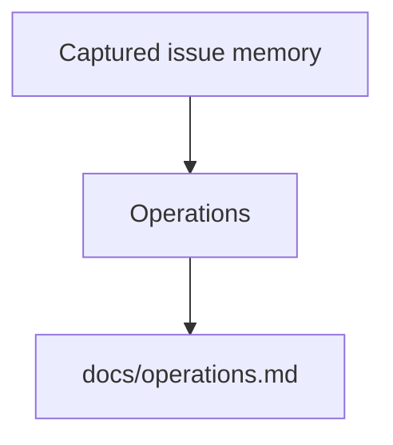

# Operations

This document covers the current local operator workflow for OpenSymphony.

Packaging note: crates.io publishes one package, `opensymphony`. The internal
`crates/opensymphony-*` directories are module trees inside that package, not
separately published dependencies.

## 1. Core commands

Recommended CLI commands:

- `opensymphony init`
- `opensymphony update`
- `opensymphony run`
- `opensymphony debug <issue-id>`
- `opensymphony tui`
- `opensymphony doctor`
- `opensymphony rehydrate <issue-id> --reason "..."`

## 2. First-run flow

```bash
cargo install opensymphony
opensymphony install openhands
opensymphony --help

cd /path/to/target-repo
opensymphony init
opensymphony update
opensymphony run
```

If you already run an external OpenHands agent-server, you can skip
`opensymphony install openhands`.

Important `init` behavior:

- fetches the current template payload
- leaves an existing `AGENTS.md` untouched and writes starter guidance to
  `AGENTS-example.md` during first-time setup
- prompts before overwriting repo-owned files
- optionally scaffolds AI PR review assets
- can configure GitHub Actions variables, the `review-this` label, and the
  optional AI review secret automatically when `gh` is installed and can access
  the target repository
- copies `.agents/skills/` recursively so helper scripts, query files, and
  reference docs all arrive together
- keeps bootstrap guidance in CLI output and the central OpenSymphony docs
  instead of copying `docs/` files into the target repository

For already-initialized repositories, `opensymphony update` is the fast
maintenance path:

- checks the latest published `opensymphony` version and skips
  `cargo install opensymphony` when the running CLI is already current
- refreshes changed or new template-managed files under `.agents/skills/`
- leaves `WORKFLOW.md`, `AGENTS.md`, `.github/*`, and repo-local extra skills
  alone

## 3. Recommended validation commands

```bash
cargo fmt --check
cargo clippy --all-targets -- -D warnings
cargo test
cargo test --test init
cargo test --test help
cargo test --test update
./scripts/smoke_local.sh
```

Useful runtime checks:

```bash
curl http://127.0.0.1:2468/healthz
curl http://127.0.0.1:2468/api/v1/snapshot
opensymphony tui --url http://127.0.0.1:2468/ --exit-after-ms 1200
```

## 4. Doctor expectations

`opensymphony doctor` is a real preflight tool.

It is optional troubleshooting/preflight help, not the primary install path for
managed local OpenHands. The normal setup flow is `cargo install opensymphony`
followed by `opensymphony install openhands`.

Current scope:

- loads and resolves the target repo `WORKFLOW.md`
- renders the workflow prompt with a synthetic issue
- validates required local tools
- validates bundled OpenHands tooling
- probes the configured OpenHands transport
- can create a temp conversation and verify runtime readiness

Expected checks include:

- config parses
- target repo exists
- `WORKFLOW.md` resolves cleanly
- required env-backed config values exist
- `cargo`, `curl`, `git`, and `uv` are on `PATH`
- the pinned OpenHands toolchain is present
- loopback/local safety warnings are surfaced

When the configured transport uses managed local OpenHands, `doctor` can
bootstrap the pinned tooling into the configured `openhands.tool_dir` before
continuing the rest of its checks.

## 5. Linear operational model

OpenSymphony 1.0.0 is GraphQL-only for agent-side Linear operations.

Operational implications:

- there is no separate local Linear bridge process to start
- initialized target repos rely on `LINEAR_API_KEY`
- the checked-in helper lives at
  `.agents/skills/linear/scripts/linear_graphql.py`
- checked-in query files under `.agents/skills/linear/queries/` are the
  supported mutation/query surface
- issue creation, issue rewrite passes, blocker relations, comments, PR
  attachments, and project updates should all use those checked-in assets

Smoke test:

```bash
cd /path/to/target-repo
python3 .agents/skills/linear/scripts/linear_graphql.py \
  --query-file .agents/skills/linear/queries/viewer.graphql
```

## 6. Project memory

Project memory stores policy and learned structure in
`.opensymphony/memory/memory.yaml` and private runtime artifacts under
`.opensymphony/memory/`. `opensymphony run` captures terminal issue transitions
automatically when `memory.auto_capture` is enabled in `config.yaml`:

```yaml
memory:
  auto_capture: true
  auto_archive: false
```

Manual commands remain available for setup, backfill, inspection, and guarded
archive operations:

```bash
opensymphony memory init
opensymphony memory capture COE-123
opensymphony memory status
opensymphony memory brief COE-123
opensymphony memory related --paths crates/opensymphony-openhands
opensymphony memory sync-docs --since-last-sync
opensymphony memory lint --public-docs
```

Add `--dry-run` to write commands when an operator wants a non-writing preview.

Use `opensymphony memory import --source-file completed.yaml` only for
deterministic imports, migrations, tests, or external exports. Failed Linear or
GitHub access should be fixed before live capture is retried.

`memory capture` creates or refreshes issue capsules, updates
`.opensymphony/memory/memory.duckdb`, and refreshes markdown indexes when
enabled. The index is built with DuckDB's bundled native library so operators
do not need to install DuckDB separately, at the cost of heavier Rust compile
time and a larger binary. Treat that native dependency as part of the hosted
deployment threat model before enabling memory in a multi-tenant service. It
does not archive Linear issues.

Linear archival is a separate command and is guarded by captured memory:

```bash
opensymphony linear archive --issues COE-123
```

For explicit issue selectors, the archive command captures live Linear and
GitHub evidence before evaluating the guard. It blocks issues that have no
capsule or unresolved capture warnings unless `--force` is supplied. Normal mode
resolves Linear credentials from `WORKFLOW.md` and calls the Linear GraphQL
archive mutation.

If the repo uses managed local OpenHands, archive also moves the issue's
persisted OpenHands conversation into the repo-scoped `archived/` store. Normal
orchestrator runs use the sibling `active/` store, while `opensymphony debug
COE-123` searches active and archived stores and starts the managed server
against the store containing the requested conversation. If another OpenHands
server is already bound to the configured port with a different store, stop it
and retry the debug command.

See [Project Memory](memory.md) for the full command surface, import YAML
schema, and troubleshooting notes.

## 7. Rehydration

Rehydration is the explicit recreation of an OpenHands conversation while
preserving enough history for continuation.

Use it for:

- API key rotation
- broken persisted conversation state
- intentional provider/model changes

Examples:

```bash
opensymphony rehydrate COE-123 --reason "API key rotation"
opensymphony doctor --config ./config.yaml --rehydrate
```

## 8. Local safety

- prefer loopback-only OpenHands targets for local development
- treat target repos and prompts as trusted local input
- do not keep unrelated OpenHands servers running on the same configured port
- do not store provider secrets in checked-in files

## 9. Migration note

If an older target repo still contains `openhands.mcp`, remove that block.
OpenSymphony 1.0.0 expects Linear access through `LINEAR_API_KEY` and the
repo-local GraphQL helper assets copied by `opensymphony init`.

<!-- BEGIN OPENSYMPHONY MANAGED MEMORY SYNC -->

## Current model

- COE-286 contributed: PR #49: Abort active CLI worker tasks on graceful shutdown (merge `2c839fd`)
- COE-293 contributed: PR #56: fix: add OpenHands filesystem tools to coding agents (merge `2f34058`)

## Important invariants

- Preserve the behavior described in the recent captured changes unless current code and tests show it has changed.
- Use capsule source refs to inspect the original PR or Linear issue when context is ambiguous.

## Operational flow



## Known gotchas

- No area-specific gotchas were inferred from the selected memory.

## Recent changes

- COE-286: Abort active CLI worker tasks on graceful orchestrator shutdown
- COE-293: OpenHands agent has no filesystem tools - only FinishTool and ThinkTool

## Source refs

- COE-286
- COE-293

<!-- END OPENSYMPHONY MANAGED MEMORY SYNC -->
