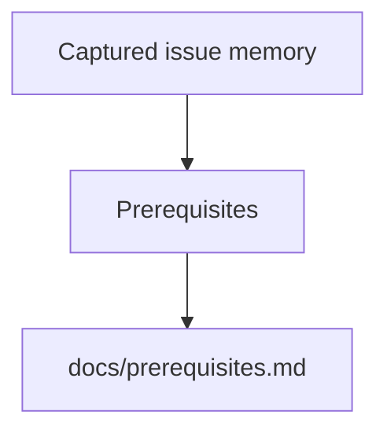

### Prerequisites

#### Rust toolchain (stable)

**macOS / Linux**
1. Visit [rustup.rs](https://rustup.rs/).
2. Copy the install command shown on that page.
3. Run it in Terminal and follow the prompts.
4. Open a new terminal window after installation.
5. Verify the installation with `rustc --version`.

**Windows**
1. Visit [rustup.rs](https://rustup.rs/).
2. Download the Windows installer shown there.
3. Run it and follow the prompts.
4. Open a new PowerShell or Command Prompt window after installation.
5. Verify the installation with `rustc --version`.

Rust installed via `rustup` uses the stable toolchain by default, which is what OpenSymphony expects.

---

#### Python 3.13.12 with `uv` for the OpenHands server

**Recommended path on macOS, Windows, and Linux**
1. Visit the [uv installation docs](https://docs.astral.sh/uv/getting-started/installation/).
2. Follow the instructions there to install `uv` for your platform.
3. Install Python 3.13.12 with `uv python install 3.13.12`.
4. Verify `uv` with `uv --version`.
5. Verify Python with `python3.13 --version`, or the equivalent command on your platform.

**Alternative**
If you already have Python 3.13.12 installed, you can keep it and just install `uv`. If you need a manual Python installer, use the official [Python downloads page](https://www.python.org/downloads/).

<!-- BEGIN OPENSYMPHONY MANAGED MEMORY SYNC -->

## Current model

- COE-275 contributed: PR #1: COE-257: tighten hosted deployment guidance

## Important invariants

- Preserve the behavior described in the recent captured changes unless current code and tests show it has changed.
- Use capsule source refs to inspect the original PR or Linear issue when context is ambiguous.

## Operational flow

## Known gotchas

- No area-specific gotchas were inferred from the selected memory.

## Recent changes

- COE-275: Remote agent-server mode and auth hardening

## Source refs

- COE-275

<!-- END OPENSYMPHONY MANAGED MEMORY SYNC -->
